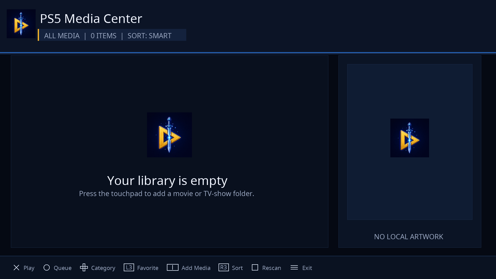

# BFplayer

BFplayer is a native media library and player for jailbroken
PlayStation 5 consoles. It runs as a single payload, installs its own tile in
the Media section, and does not require websrv or Homebrew Launcher.



## Features

- Movies, TV shows, seasons, music, and playlists
- Manual media sources with an optional whole-library import
- Resume playback, favorites, search, sorting, and playback queues
- Embedded and external subtitles with timing adjustment
- Audio, video, subtitle, and chapter selection
- Aspect-ratio, crop, and scaling controls
- Local artwork or an automatically generated video preview
- Persistent settings and rotating diagnostic logs
- Clean reinjection: a newer payload replaces the resident launcher without
  creating a second tile or resetting the library

Playback is powered by FFmpeg 7.0.1, SDL2, SDL_kitchensink, and libass. Decoding
is currently software-based, so demanding 4K HEVC or AV1 files may not play
smoothly.

The same limitation applies to 4K 50/60 fps VP9 WebM, especially 10-bit HDR
files. The player uses the 16 logical processors reported by SDL, enlarged
video buffers, and proportional 1080p output conversion for oversized sources,
but these formats can still exceed the PS5 homebrew software-decoding budget.

Every video starts in **Original** aspect mode. The player uses the display
ratio reported by the stream, including anamorphic pixel-ratio metadata, and
falls back to the decoded frame dimensions when that metadata is unavailable.
Manual aspect overrides apply only to the current video.

## Install

Download `bfplayer-standalone.elf` from the latest release and inject
that payload after each jailbreak. It installs or updates the **BFplayer**
tile in the Media section and stays resident to launch the player.

Nothing needs to be copied to `/data/homebrew` beforehand. The payload creates
and maintains its own runtime folder. Reinjection preserves the library,
settings, sources, playback history, and logs.

## Library controls

| Button | Action |
| --- | --- |
| Cross | Open or play |
| Circle | Go back inside a show or season; no action at the library root |
| Triangle | Remove the selected movie or TV source (press twice) |
| D-pad Left/Right | Change library category |
| D-pad Up/Down | Move through the list |
| L1/R1 | Previous or next page |
| L3 | Add or remove favorite |
| R3 | Change sort mode |
| Touchpad | Add media |
| Options | Open the main menu |

The Add Media browser starts at `/`. Cross opens a folder or adds a movie,
Triangle adds a folder as one TV show, and Square imports a folder as a mixed
library. Mixed import treats loose video files as movies and child folders as
TV shows.

## Playback controls

| Button | Action |
| --- | --- |
| Cross | Pause or resume |
| Circle | Change subtitle track |
| Square | Change audio track |
| Triangle | Change video track |
| D-pad Left/Right | Short seek |
| D-pad Down/Up | Long seek |
| L1/R1 | Previous or next chapter |
| L3/R3 | Volume down or up |
| Touchpad | Show the full control list |
| Options | Open playback menu |

Display controls are available through the playback menu and controller
shortcuts, including scaling, aspect ratio, and crop mode.

## Logs

Runtime logs are stored under:

```text
/data/BFplayer/logs
```

The repository includes `collect-logs.ps1` for copying the current and previous
logs from a console. More details are in [docs/DIAGNOSTICS.md](docs/DIAGNOSTICS.md).

## Building

The project uses
[ps5-payload-sdk](https://github.com/ps5-payload-dev/sdk) and PacBrew v0.37.
From the project directory:

```powershell
. ..\..\ps5dev-env.ps1
.\build.ps1 -Configuration Release
```

Release artifacts are written to `dist/`.

## Notes

- The dashboard title ID is `PSMC00001`.
- The launcher listens only on `127.0.0.1:9040`.
- Network services are intended for a trusted local network.
- Hardware and format behavior can vary by firmware, HEN, storage device, and
  media encoding.

See [docs/STANDALONE_LAUNCHER.md](docs/STANDALONE_LAUNCHER.md) for launcher
details and [THIRD_PARTY_NOTICES.md](THIRD_PARTY_NOTICES.md) for bundled
components and licenses.

## License

GPL-3.0-or-later. See [LICENSE](LICENSE).
